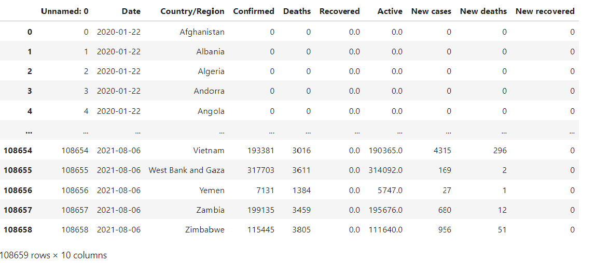
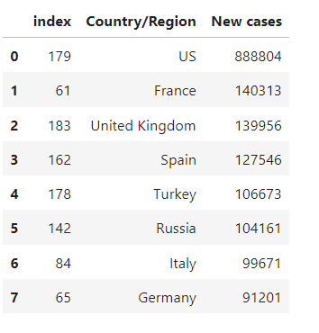
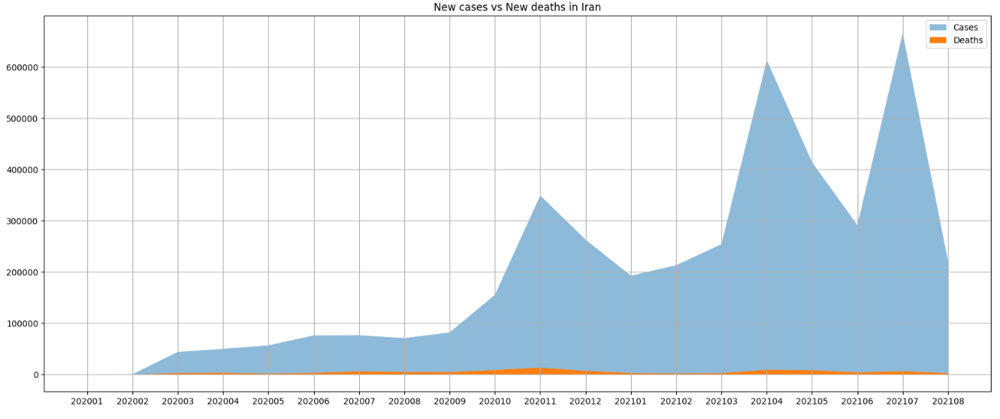
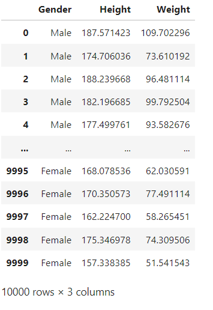
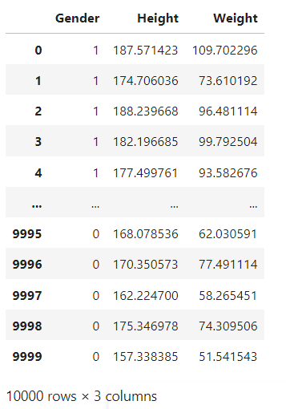

# Machine_Learning3
Knn

## les bibliothèque les plus importants dans ce program :
- numpy
- matplotlib
- pandas

## Covid_19 dataset :

Nous avon des statistiques sur la pandémie dans les années 2020 et 2021 dans le mond :

### Voici Les huits pays avec les plus grands nombres des patients de corona virus pendant avril en 2020 :

### des statistiques des Iraniens pendant la pandémie selon le nombre des décès et le nombre des patients :

---

## Weight_Height_Knn :

- Des statistique d'hauteur et de poid des hommes et des femmes:

Height(cm) / weight(kg)

- on a converti le genre en zéro et un par la méthode de (replace)

### les hommes --> 1
### les femmes --> 0

- class kNearestNeighbors : la class origine avec 5 méthodes 

1. fit (qui recevoit des donnes pour TRAIN)
2. euclidianDistance (qui calcule la distence)
3. nearNeighbors (qui nous donne le sexe des voisins les plus proches)
4. predict (qui nous donne l'argument du nombre le plus repetitif)
5. evaluate (calcule la fidélité de l'algorithme )